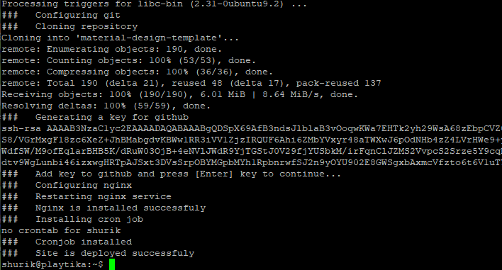
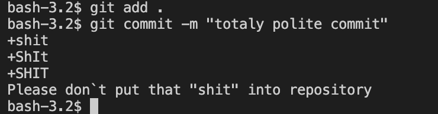
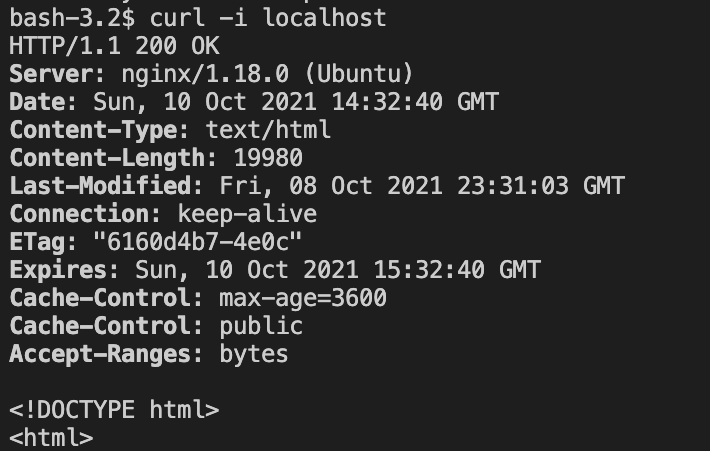
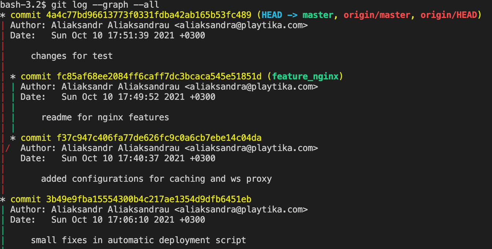
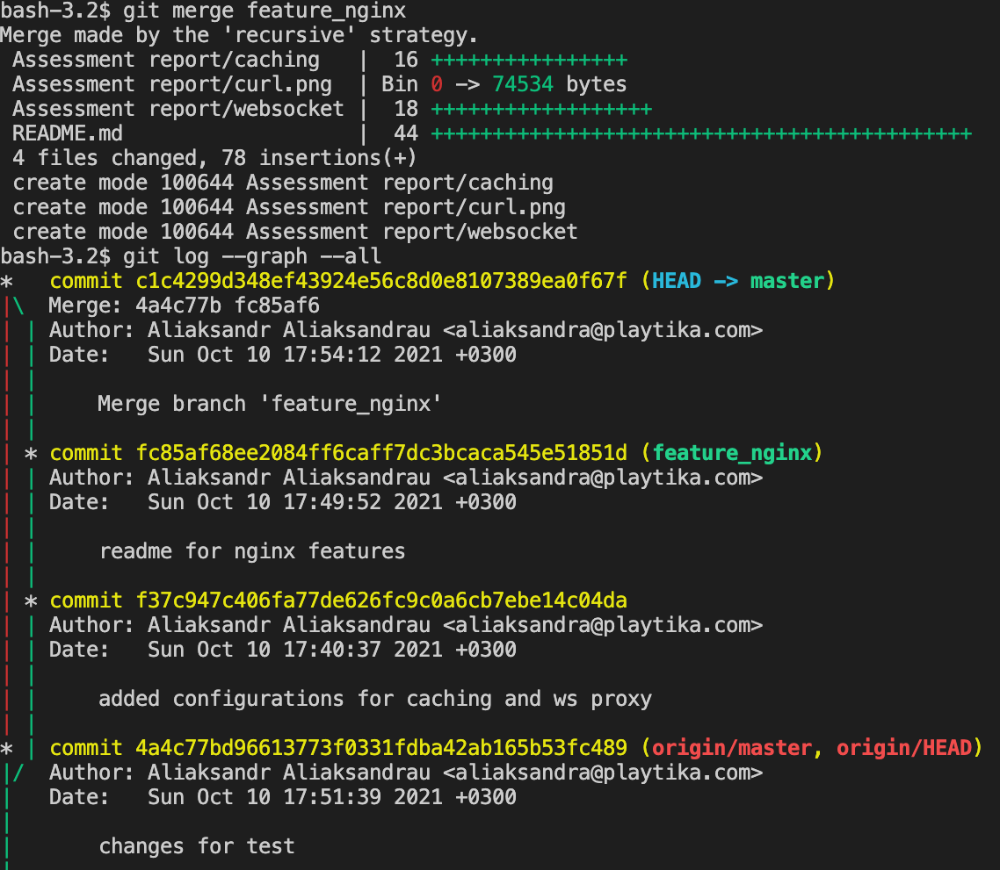
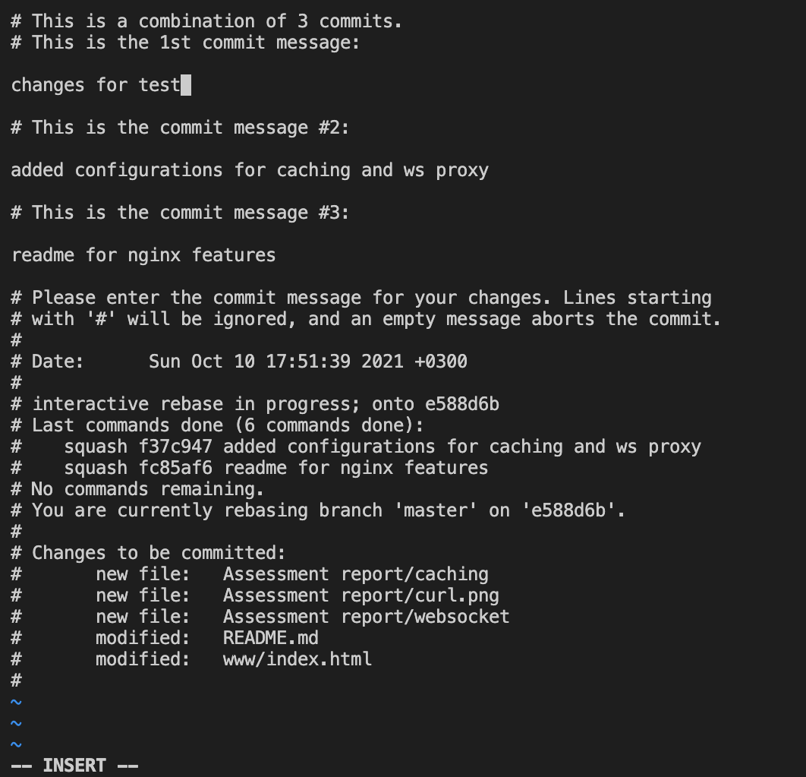
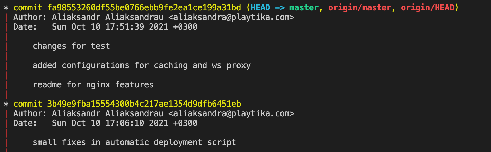

# Assessment report:
## Commands used in linux VM:
**There is also a script provided for automatic deployment. You can find it in Assessment-report/deploy.sh**

~~~
sudo apt-get update
sudo apt-get upgrade
sudo apt-get install nginx git
sudo systemctl status nginx
git config --global user.name "*********”
git config --global user.email "********"
git clone https://github.com/shurikby/material-design-template.git
ssh-keygen
cat /home/shurik/.ssh/id_rsa.pub
git remote set-url origin git@github.com:shurikby/material-design-template
cp /etc/nginx/sites-available/default ~/default.bak  #making backup of nginx site configuration
sudo vi /etc/nginx/sites-available/default
sudo nginx -T   # test and show nginx configuration
sudo systemctl restart nginx
crontab -e
sudo systemctl restart cron
grep CRON /var/log/syslog   # check if job is actually running
~~~

## Cronjob

    * * * * * /bin/sh -c 'cd /home/shurik/material-design-template && /usr/bin/git pull origin master' 2>&1 | /usr/bin/logger -t CRON_gitpull
I am sending an output of cronjob to syslog to confirm that everything works as expected. 
Here is `grep CRON /var/log/syslog` output (screenshot is also available in "Assessment-report" folder):
~~~
Oct  8 14:42:01 ubuntu CRON[2355]: (shurik) CMD (/bin/sh -c 'cd /home/shurik/material-design-template && /usr/bin/git pull origin master' 2>&1 | /usr/bin/logger -t CRON_gitpull)
Oct  8 14:42:03 ubuntu CRON_gitpull: From github.com:shurikby/material-design-template
Oct  8 14:42:03 ubuntu CRON_gitpull:  * branch            master     -> FETCH_HEAD
Oct  8 14:42:03 ubuntu CRON_gitpull: Already up to date.
Oct  8 14:43:01 ubuntu CRON[2371]: (shurik) CMD (/bin/sh -c 'cd /home/shurik/material-design-template && /usr/bin/git pull origin master' 2>&1 | /usr/bin/logger -t CRON_gitpull)
Oct  8 14:43:03 ubuntu CRON_gitpull: From github.com:shurikby/material-design-template
Oct  8 14:43:03 ubuntu CRON_gitpull:  * branch            master     -> FETCH_HEAD
Oct  8 14:43:03 ubuntu CRON_gitpull: Already up to date.
Oct  8 14:44:01 ubuntu CRON[2382]: (shurik) CMD (/bin/sh -c 'cd /home/shurik/material-design-template && /usr/bin/git pull origin master' 2>&1 | /usr/bin/logger -t CRON_gitpull)
Oct  8 14:44:02 ubuntu CRON_gitpull: From github.com:shurikby/material-design-template
Oct  8 14:44:02 ubuntu CRON_gitpull:  * branch            master     -> FETCH_HEAD
Oct  8 14:44:02 ubuntu CRON_gitpull: Already up to date.
Oct  8 14:45:01 ubuntu CRON[2395]: (shurik) CMD (/bin/sh -c 'cd /home/shurik/material-design-template && /usr/bin/git pull origin master' 2>&1 | /usr/bin/logger -t CRON_gitpull)
Oct  8 14:45:03 ubuntu CRON_gitpull: From github.com:shurikby/material-design-template
Oct  8 14:45:03 ubuntu CRON_gitpull:  * branch            master     -> FETCH_HEAD
Oct  8 14:45:04 ubuntu CRON_gitpull: Already up to date.
Oct  8 14:46:01 ubuntu CRON[2406]: (shurik) CMD (/bin/sh -c 'cd /home/shurik/material-design-template && /usr/bin/git pull origin master' 2>&1 | /usr/bin/logger -t CRON_gitpull)
Oct  8 14:46:02 ubuntu CRON_gitpull: From github.com:shurikby/material-design-template
Oct  8 14:46:02 ubuntu CRON_gitpull:  * branch            master     -> FETCH_HEAD
Oct  8 14:46:02 ubuntu CRON_gitpull:    9ac5de8..4a7b237  master     -> origin/master
Oct  8 14:46:02 ubuntu CRON_gitpull: Updating 9ac5de8..4a7b237
Oct  8 14:46:02 ubuntu CRON_gitpull: Fast-forward
Oct  8 14:46:02 ubuntu CRON_gitpull:  README.md      | 16 +++++++++-------
Oct  8 14:46:02 ubuntu CRON_gitpull:  www/index.html |  2 +-
Oct  8 14:46:02 ubuntu CRON_gitpull:  2 files changed, 10 insertions(+), 8 deletions(-)
~~~

## Nginx configuration

file `/etc/nginx/sites-available/default`:
~~~
---	root /var/www/html;
+++	root /home/shurik/material-design-template/www;
~~~
I have changed web root path to the folder containing git repository in my home folder.

## Git hook
You can find a script file and screenshot of the result in the report folder. 
I have to use "-n" key now to commit it.

## Websockets proxy configuration:
file `/etc/nginx/sites-available/websocket`:
~~~
    map $http_upgrade $connection_upgrade {
        default upgrade;
        '' close;
    }

    upstream websocket {
        server 10.10.10.10:80;
    }

    server {
        listen 8888;
        location / {
            proxy_pass http://websocket;
            proxy_http_version 1.1;
            proxy_set_header Upgrade $http_upgrade;
            proxy_set_header Connection $connection_upgrade;
            proxy_set_header Host $host;
        }
~~~

## Cache static files 
file `/etc/nginx/sites-available/default`:

~~~
server {
        listen 80 default_server;
        listen [::]:80 default_server;

        root /home/shurik/material-design-template/www;

        index index.html index.htm;

        server_name _;

        location ~* \.(?:html?|xml|json|jpg|jpeg|gif|png|ico|css|js)$ {
          expires 1h;
          add_header Cache-Control "public";
          access_log off;
        }
}
~~~
We can check if cacheing enabled using curl:

## Merge feature branch with main, rebase git merge commit, squash all commits
 ~~~
git checkout -b feature_nginx
git add .
git commit
git log --graph --all
 ~~~
    
~~~
git checkout master
git add .
git commit
git merge feature_nging
~~~
    
~~~
git rebase -i
git log --graph --all
~~~
    
    
