# Simple CI pipeline
## Create Jenkins VM with internet access - 1
~~~
 wget -q -O - https://pkg.jenkins.io/debian-stable/jenkins.io.key | sudo apt-key add -  #add jenkins repository key
 sudo sh -c 'echo deb http://pkg.jenkins.io/debian-stable binary/ > /etc/apt/sources.list.d/jenkins.list' #add jenkins repository
 sudo apt update && sudo apt install -y openjdk-8-jre git && sudo apt install -y jenkins # install openjdk-8-jre, git, jenkins
 sudo systemctl enable jenkins #enabling autostart on startup 
 systemctl status jenkins #check if it works
 java -version #verify that java is installed
 cat /var/lib/jenkins/secrets/initialAdminPassword #get initial password
 vi /etc/default/jenkins #edit Jenkins config
~~~
Changing port from 8080 to 8081:
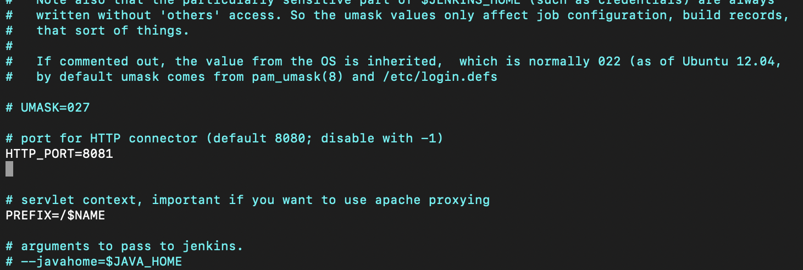
It is also important to change Jenkins URL for it to function properly:
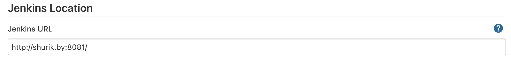
Installing Jenkins from web browser with additional plugins:
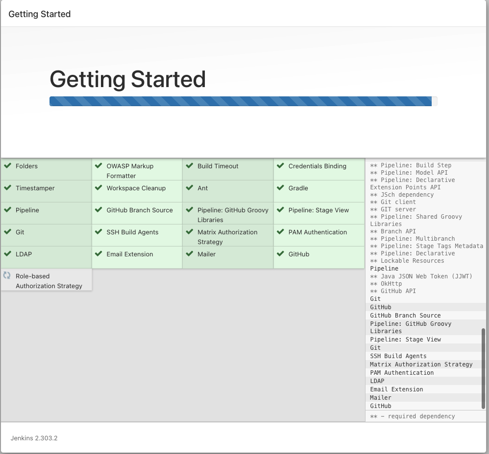
Adding user to jenkins:
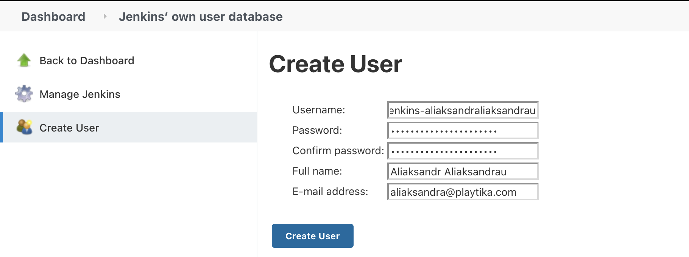
## Create Agent VM - 1 
~~~
### On slave node:
sudo apt update && sudo apt install -y openjdk-8-jre git
java -version #verify that java is installed
sudo useradd jenkins-aliaksandraliaksandrau #add user for Jenkins
### On master node:
sudo su - jenkins #login under jenkins user
ssh-keygen #generate keys
cat /var/lib/jenkins/.ssh/id_rsa
ssh-copy-id jenkins-aliaksandraliaksandrau@192.168.1.12 #copy public key to slave node
~~~
Java is installed:
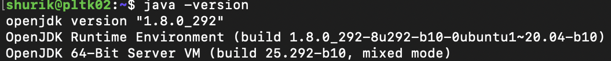
Adding credentials to Jenkins:
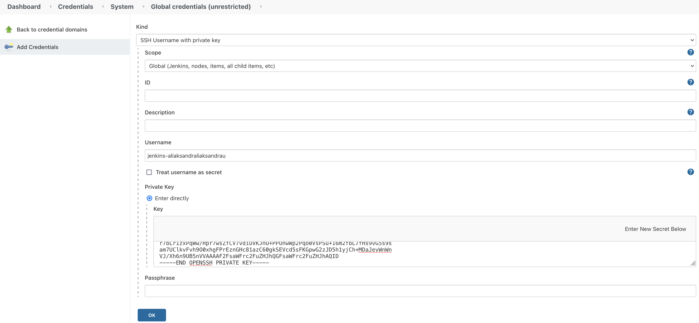
Adding node to Jenkins:
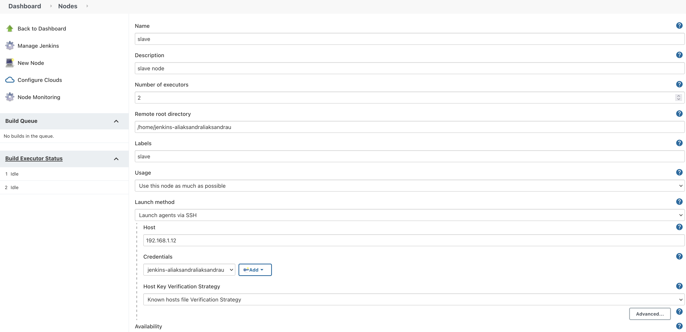
Slave node is connected successfully:
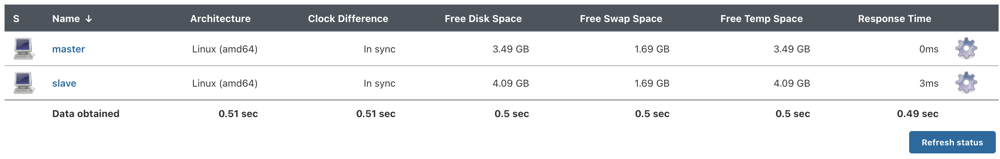
## Configure tools – NodeJS - 1 
Installed Jenkins plugin NodeJS
Then configuring it in Global Tools Configuration:
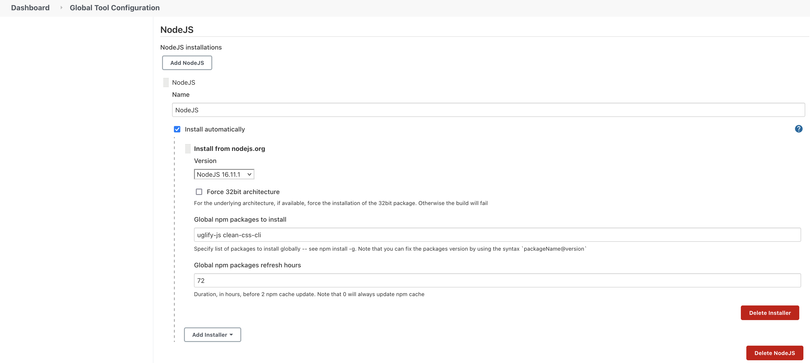
Small test job to test if node js is installed properly:
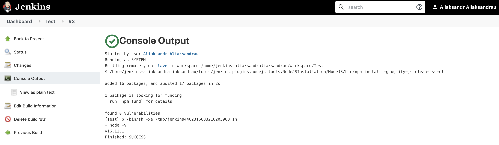
## Create “Multibranch Pipeline” pipeline job (work inside Lab folder) - 3 
Created Multibranch pipeline named "AliaksandrAliaksandrau" inside Lab folder using the following configuration for branch sources:
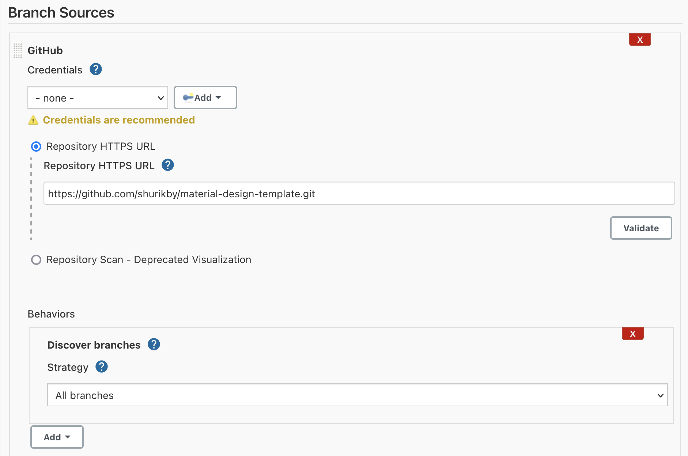
Created a following Jenkinsfile with declarative pipeline:
```
pipeline{
	agent {
		label 'slave' //running on node "slave"
	}
	tools {
		nodejs 'NodeJS' // NodeJS definition
	}
	stages{
		stage ('compressing'){
			parallel{
				stage ('JS'){
					steps{
	  					sh "ls www/js/ | xargs -I{file} uglifyjs www/js/{file} -o www/min/{file} --compress"  // compressing JS
					} 
   				}
   				stage ('CSS'){
					steps{
						sh  "ls www/css/ | xargs -I{file} cleancss www/css/{file} -o www/min/{file}" // cleaning CSS
					}
   				}
			}
		}
	}
	post{
		always {
			sh "tar --exclude=.git --exclude=www/css --exclude=www/js -czvf artifacts.tar.gz *"  // archiving excluding specified files
			archiveArtifacts artifacts: 'artifacts.tar.gz' // saving artifacts
			deleteDir() // cleaning up working directory
		}
		success {
			echo "Success"
		}
		failure {
			echo "There was some error"
		}        
	}

}
```
Results:
All the results are being packed in the tar and archived as build artifacts.
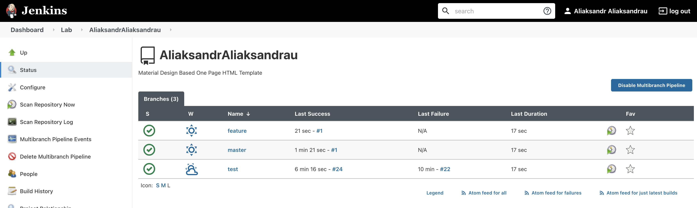
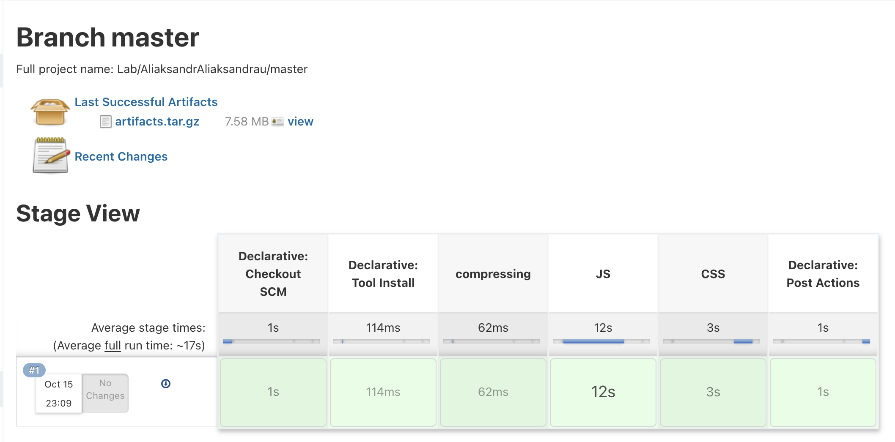
Using "Blue Ocean" plugin to confirm stages running in parallel:
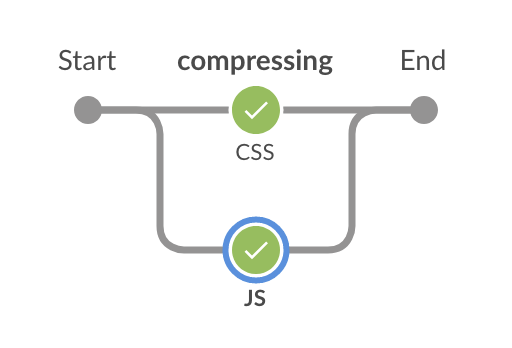
## Setup the GitHub webhook to trigger the jobs - 2 
Configuring github in Jenkins configuration:
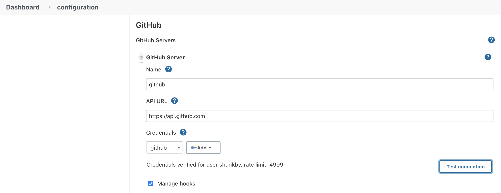
Generating private token for Jenkins (Saved as "Secret text" in Jenkins credentials):
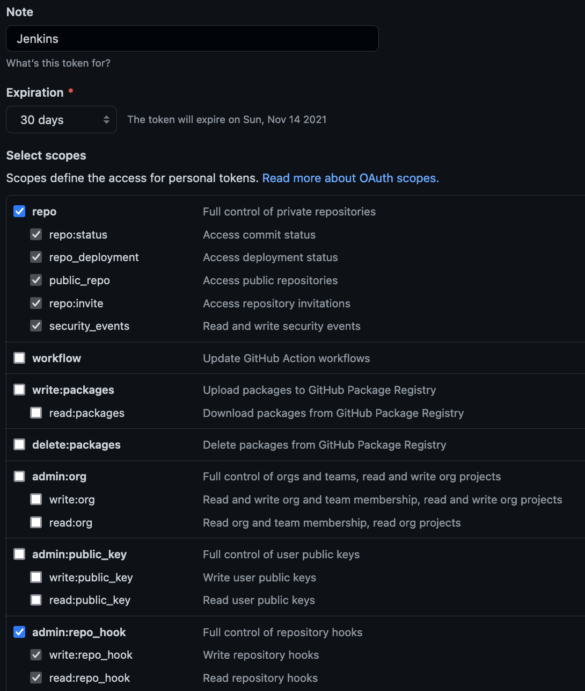
Creating a webhook in Github interface
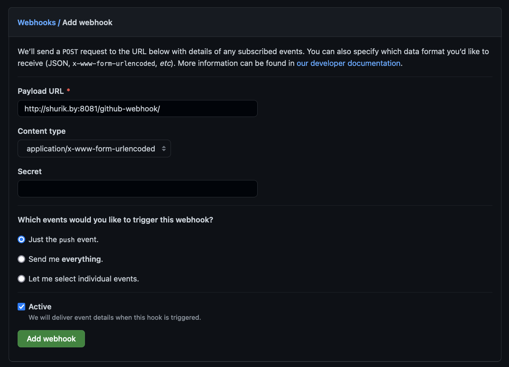
Results:
Build is started by push event:
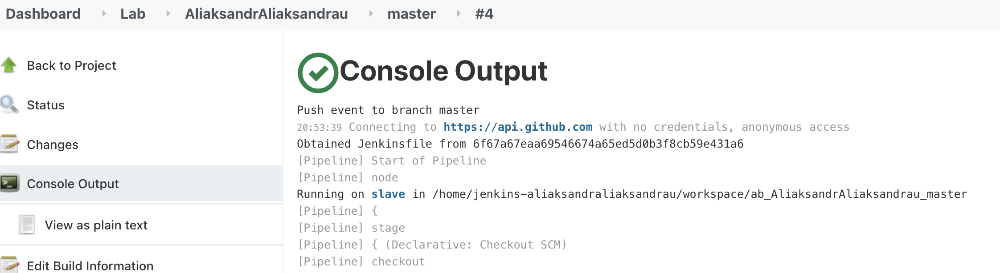
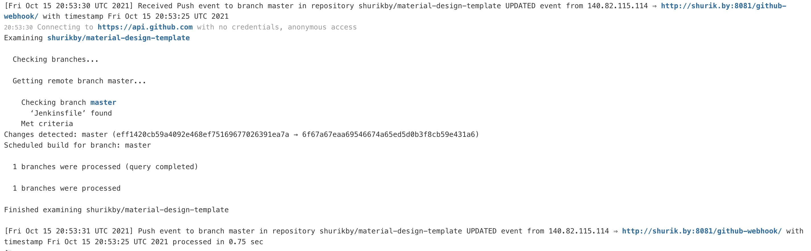
##  * Use Scripted pipeline instead of declarative - * 


## * Spin up VM with installed Artifactory - *  


## * Add new stage for publishing artifacts into Artifactory - * 